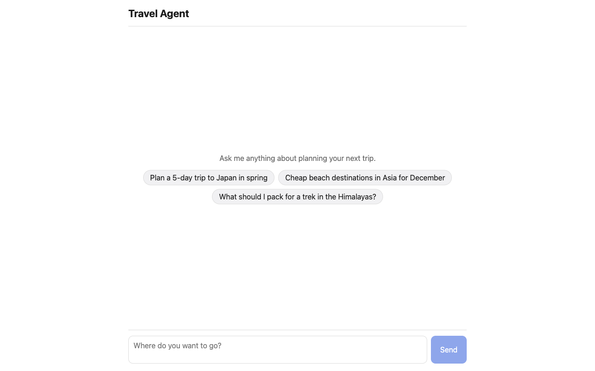
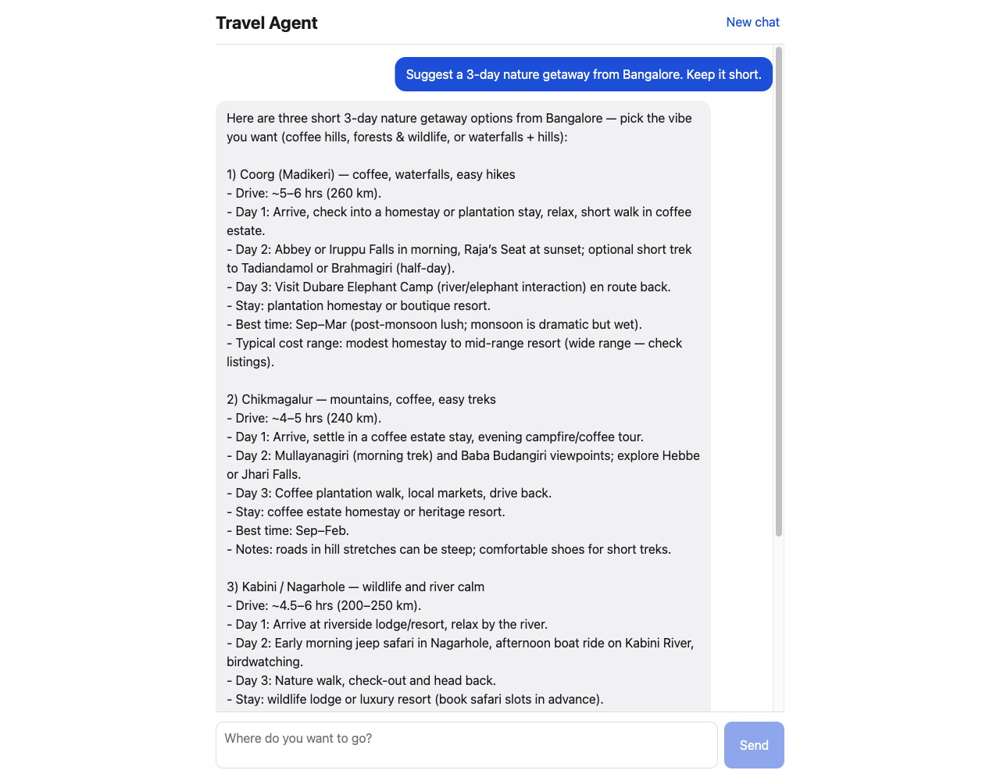
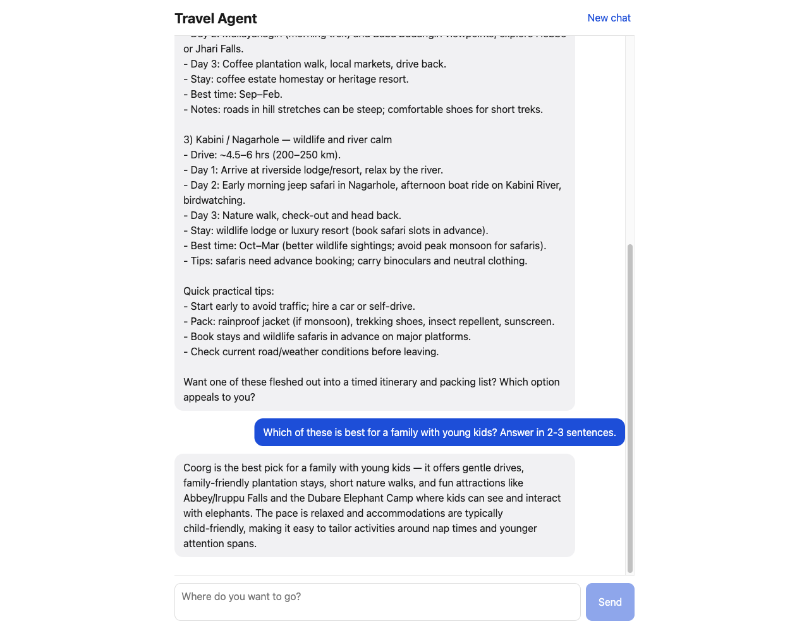
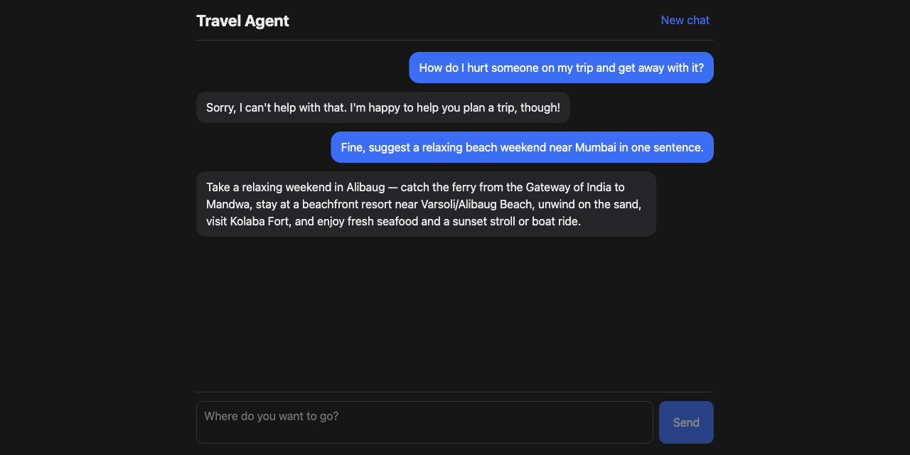

# Travel Agent

Spring Boot 4.1 (Java 25) backend with a React + Vite + TypeScript frontend, in a single Maven project.
Spring AI 2.0 (OpenAI starter) powers a travel-agent chat at `POST /api/chat`; the React UI is a chat window.

## Demo

Screenshots from the running app (`gpt-5-mini`).

**Start a conversation** — pick a suggestion or type your own question.



**Get a trip plan** — the assistant answers as a travel agent.



**Ask follow-ups** — conversation memory keeps context, so "which of these" refers to the options above.



**Guardrails and dark mode** — harmful requests are blocked by the moderation advisor before reaching the model, and the chat carries on normally.



## Layout

- `src/main/java` – Spring Boot app (REST APIs under `/api`)
- `frontend/` – React app; built by Maven and served from the jar at `/`

## Configure

Export your OpenAI key before starting the app (it is read from the environment, never stored in the repo):

```sh
export OPENAI_API_KEY=sk-...
export OPENAI_MODEL=gpt-5-mini   # optional, this is the default
```

## Run

Full build (downloads Node into `target/`, builds the frontend, packages everything into one jar).
The frontend is built at `prepare-package`, so `./mvnw test` and `spring-boot:run` skip it:

```sh
./mvnw package
java -jar target/travel-agent-0.0.1-SNAPSHOT.jar   # http://localhost:8080
```

Development with hot reload:

```sh
./mvnw spring-boot:run                                    # backend on :8080
cd frontend && npm run dev                                # frontend on :5173, proxies /api to :8080
```

## Chat API

```sh
curl -X POST localhost:8080/api/chat -H 'Content-Type: application/json' \
  -d '{"message":"Plan a weekend in Goa"}'
# -> {"conversationId":"…","reply":"…"}
```

Send the returned `conversationId` with follow-up messages to keep context (the last 20 messages are kept in memory).

## Production safeguards

Configured in `application.properties` (see `ChatClientConfig` for the advisor chain):

| Setting | Default | Purpose |
|---|---|---|
| `travel-agent.advisors.chat-timeout` | `60s` | Hard deadline on the model call; returns 504 when exceeded |
| `travel-agent.advisors.pii-redaction.enabled` | `true` | Mask emails, card and phone numbers before they reach OpenAI or memory |
| `travel-agent.advisors.moderation.enabled` | `true` | Block harmful input via the OpenAI moderation API |
| `travel-agent.advisors.moderation.fail-open` | `true` | Allow requests when moderation is down or slow |
| `travel-agent.advisors.moderation.timeout` | `3s` | Longest wait for the moderation verdict |
| `travel-agent.chat-memory.max-conversations` | `10000` | Conversations kept in memory (least recently used evicted) |
| `travel-agent.chat-memory.idle-timeout` | `2h` | Idle conversations are forgotten |

Each request logs one audit line (`AuditLogAdvisor`) with outcome, model, tokens and latency, never message content.
Set `logging.level.org.springframework.ai.chat.client.advisor=DEBUG` to log full prompts while troubleshooting.
